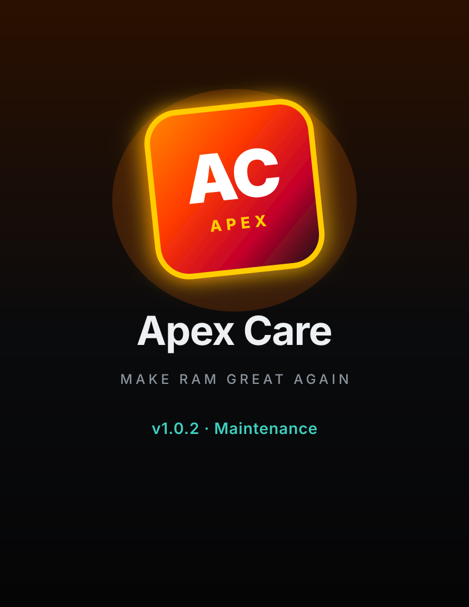

<p align="center">
  
</p>

<h1 align="center">Apex Care</h1>
<p align="center"><strong>v1.0.4 - Maintenance</strong><br/>
<em>Make RAM Great Again</em></p>

<p align="center">
  <a href="https://github.com/l3g1Xn/apex-samsung-care/releases/latest"></a>
  <a href="https://github.com/l3g1Xn/apex-samsung-care/releases/latest"></a>
  <a href="https://github.com/l3g1Xn/apex-samsung-care/actions/workflows/ci.yml"></a>
</p>

---

Sideloaded Samsung device care for **One UI**. Accurate free RAM (Device Care model), force-close cleanup, Magisk-aware temporary root, and a home-screen RAM widget.

### Download

**[Apex Care v1.0.4](https://github.com/l3g1Xn/apex-samsung-care/releases/tag/v1.0.4)** - [ApexCare-v1.0.4.apk](https://github.com/l3g1Xn/apex-samsung-care/releases/download/v1.0.4/ApexCare-v1.0.4.apk)

v1.0.4 is the **only** GitHub Release. Older APKs and tags are not published.

1. Uninstall any older Apex Care if Android asks
2. Install the signed universal APK
3. Open, Grant Temporary Root (optional), Optimize / Clean

Package `com.apexcare.app` - versionCode **24** / **1.0.4** - minSdk **24** / targetSdk **34** - signed v1+v2+v3

---

## What it does

| Area | Behavior |
|------|----------|
| **RAM** | Device Care model: free = available, used = total minus available; marketed total scanned on install |
| **Optimize / Clean** | Force-closes non-vital apps (`am force-stop` with root; background kill without) |
| **Grant Temporary Root** | In-process Magisk `su` (no Magisk app switch) or userspace TEMP ROOT (30 min) |
| **Widget** | Free % primary, used / available GB, Clean action |
| **Safe** | On-device heuristics, debuggable / outdated SDK signals |

## v1.0.4 (sole published APK)

Incremental - **not** a Full Send rebrand. Sideload over any older Apex Care (same demo cert, higher versionCode).

- Optimize and Safe scan **auto-engage TEMP ROOT** (Magisk su if already granted) before reclaim
- Hanging / failed-close **retry pass** plus `am kill` / `stop-app` / compact / trim (no SIGKILL)
- Cached RAM-blob findings on Safe scan
- Play Protect: dropped unused `PACKAGE_USAGE_STATS`, no `/data/local/tmp/su`, no `kill -9`
- Bulk Optimize and widget Clean **skip foreground / visible** processes (low-end One UI + Flip cover)
- User protect list (validated packages, cap 80) honored on every force-stop path
- Protect list: camera, gallery, Samsung Account, Google Wallet, Messages, Secure Folder, Bixby, Quick Share, Android Auto, IMS, Galaxy AI
- Optimize / batch close sample RAM with `sampleFast` (no 7x sleep after a bulk pass)
- PSS lookups capped at 80 running packages for low-RAM A-series
- Shell command allowlist + package-name validation (no injection into `su -c`)
- WebView **offline** via `WebViewAssetLoader`; fallback is `loadDataWithBaseURL` (never `file://`)
- First-open HW RAM scan is sleep-free on the UI thread; widget Clean runs off the main looper

## Magisk + Temporary Root

Grant Root stays **inside Apex Care**:
1. Detects Magisk Manager when present
2. Boot patched - Magisk Superuser via `su` (overlay only if needed)
3. App-only / Superuser empty - userspace TEMP ROOT (30 min)
4. Real `am force-stop` only when Magisk grants

## Root reality

No APK can auto-grant `uid=0` on install. Magisk/KernelSU must already be on the device and allow Apex Care.

## Build

```bash
cd android
echo "sdk.dir=$ANDROID_HOME" > local.properties
./gradlew assembleRelease
```

A `v*` tag replaces the **sole** GitHub Release (older tags/APKs are dropped). Actions build logs are deleted when the job finishes.

## Safety

See [SECURITY.md](SECURITY.md). Protect list covers core OS, telephony, keyboard, Play services, Knox, Magisk, Apex itself. Heuristics stay on-device. Demo signing for sideload only.

---

**Not affiliated with Samsung, Google, or Magisk.**  
**Apex Care v1.0.4 - Make RAM Great Again.**
