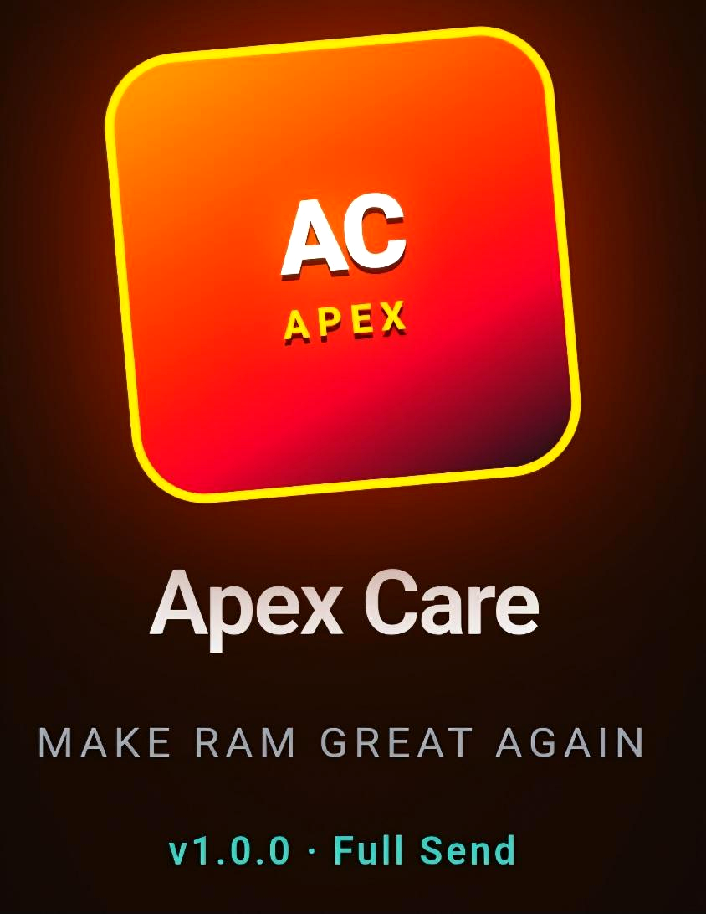

<p align="center">
  
</p>

<h1 align="center">Apex Care</h1>
<p align="center"><strong>v1.0.1 · Maintenance</strong><br/>
<em>Make RAM Great Again</em></p>

<p align="center">
  <a href="https://github.com/l3g1Xn/apex-samsung-care/releases/latest"></a>
  <a href="https://github.com/l3g1Xn/apex-samsung-care/releases/latest"></a>
  <a href="https://github.com/l3g1Xn/apex-samsung-care/actions/workflows/ci.yml"></a>
</p>

---

Sideloaded Samsung device care for **One UI**. Accurate free RAM (Device Care model), force-close cleanup, Magisk-aware temporary root, and a home-screen RAM widget.

### Download

**[Latest release](https://github.com/l3g1Xn/apex-samsung-care/releases/latest)** · prior sole build: [v1.0.0 Full Send](https://github.com/l3g1Xn/apex-samsung-care/releases/tag/v1.0.0)

1. Uninstall any older Apex Care if Android asks  
2. Install the signed universal APK  
3. Open → Grant Temporary Root (optional) · Optimize / Clean  

Package `com.apexcare.app` · versionCode **19** · versionName **1.0.1** · minSdk **24** / targetSdk **34** · signed v1+v2+v3

---

## What it does

| Area | Behavior |
|------|----------|
| **RAM** | Device Care model: free = available, used = total − available; marketed total scanned on install |
| **Optimize / Clean** | Force-closes non-vital apps (`am force-stop` with root; background kill without) |
| **Grant Temporary Root** | In-process Magisk `su` (no Magisk app switch) or userspace TEMP ROOT (30 min) |
| **Widget** | Free % primary · used / available GB · Clean action |
| **Safe** | On-device heuristics · debuggable / outdated SDK signals |

## v1.0.1 maintenance (this line)

- Shell **command allowlist** + package-name validation (no injection into `su -c`)
- Expanded One UI **protect list** (telephony, input, Knox, Magisk, launcher, GMS)
- WebView **offline** · no file cross-origin · backup disabled
- CI builds on every `main` push **without** wiping prior releases
- Diagnostics / health ping + 12s free% refresh for uptime visibility
- Demo bridge in the packaged UI for offline QA when native is absent

## Magisk + Temporary Root

Grant Root stays **inside Apex Care**:
1. Detects Magisk Manager when present  
2. Boot patched → Magisk Superuser via `su` (overlay only if needed)  
3. App-only / Superuser empty → userspace TEMP ROOT (30 min)  
4. Real `am force-stop` only when Magisk grants  

## Root reality

No APK can auto-grant `uid=0` on install. Magisk/KernelSU must already be on the device and allow Apex Care.

## Build

```bash
cd android
echo "sdk.dir=$ANDROID_HOME" > local.properties
./gradlew assembleRelease
```

Release tags (`v*`) publish a new APK asset; they **do not** delete prior releases.

## Safety

See [SECURITY.md](SECURITY.md). Protect list covers core OS, telephony, keyboard, Play services, Knox, Magisk, Apex itself. Heuristics stay on-device. Demo signing for sideload only.

---

**Not affiliated with Samsung, Google, or Magisk.**  
**Apex Care — Make RAM Great Again.**
